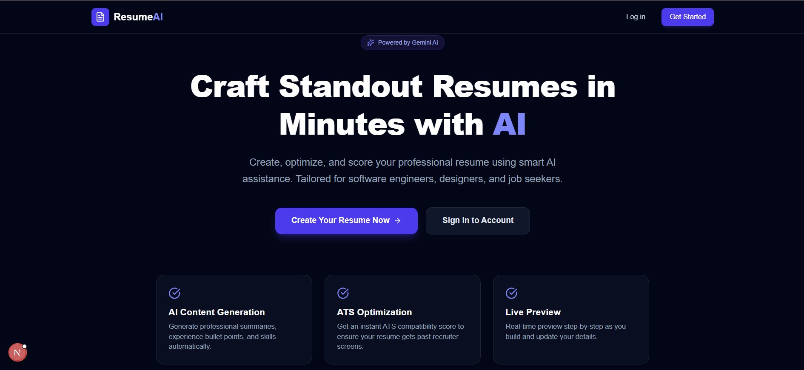
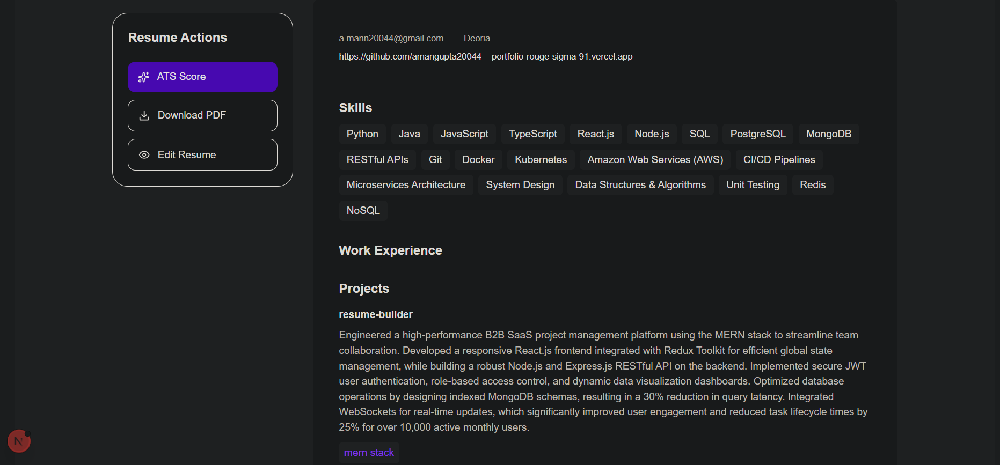

<div align="center">

  # 📄 ResumeCraft AI — Next-Gen Resume Engine

  An AI-assisted resume builder built with Next.js 16 (App Router), MongoDB, and Google Gemini. Multi-step resume drafting, AI-enhanced content generation, live previewing, and ATS scoring.

</div>

---

<!-- Previews: place screenshots at public/resume-preview.png and public/resume.png -->
<p align="center">
  
  
</p>

---

## Table of Contents

- [Overview](#overview)
- [Project Structure](#project-structure)
- [Architecture & Workflow](#architecture--workflow)
- [Quick Start](#quick-start)
- [Environment](#environment)
- [Development Commands](#development-commands)
- [API Endpoints](#api-endpoints)
- [Deployment](#deployment)
- [Contributing](#contributing)
- [License & Contact](#license--contact)

## Overview

ResumeCraft AI provides an interactive, stepwise resume builder with inline AI tools to generate bullet points, summaries, and skills, plus a preview screen suitable for exporting to PDF.

## Project Structure

Top-level project folders (key files linked):

- [src/app](src/app) — App Router pages, layouts and route handlers
  - [src/app/resume/page.tsx](src/app/resume/page.tsx) — Dashboard & create modal
  - [src/app/resume/[resumeId]/page.tsx](src/app/resume/[resumeId]/page.tsx) — Builder UI
  - [src/app/resume/[resumeId]/preview/page.tsx](src/app/resume/[resumeId]/preview/page.tsx) — Preview wrapper
- [src/apis](src/apis) — Frontend `axios` wrappers (e.g., [src/apis/resume.api.ts](src/apis/resume.api.ts))
- [src/components](src/components) — Builder step components (PersonalInfoStep, EducationStep, etc.)
- [src/lib](src/lib) — Server utilities (`getCurrentUser.ts`, `mongodb.ts`, `jwt.ts`, `gemini.ts`)
- [src/models](src/models) — Mongoose schemas ([src/models/Resume.model.ts](src/models/Resume.model.ts))
- [src/types](src/types) — Shared TypeScript interfaces

## Architecture & Workflow

1. Client: Next.js App Router renders pages and interactive client components for builder steps.
2. API Layer: Route handlers under `src/app/api/*` implement REST endpoints for resumes, auth, and AI helpers.
3. AI Gateway: `/api/ai/*` routes forward structured prompts to Google Gemini and return enhanced text.
4. Persistence: Mongoose stores `User` and `Resume` documents in MongoDB.
5. Preview: `/resume/[resumeId]/preview` uses a server wrapper and a client preview renderer for live display and PDF export.

## Quick Start

Prerequisites

- Node.js 18+ (recommended 18.18 or 20+)
- npm v9+ or pnpm
- MongoDB (local or Atlas)
- Google Gemini API key (optional for AI features)

Create a `.env.local` in the project root and add the minimum variables:

```env
# MongoDB connection
MONGODB_URI=mongodb+srv://<user>:<pass>@cluster0.mongodb.net/resume-db

# JWT
JWT_SECRET=your_jwt_secret

# Google Gemini (optional)
GEMINI_API_KEY=your_gemini_api_key

# App
NEXT_PUBLIC_APP_URL=http://localhost:3000
```

Install and run locally

```bash
npm install
npm run dev
# Open http://localhost:3000
```

## Environment & Configuration

- `MONGODB_URI` — MongoDB connection string.
- `JWT_SECRET` — secret used to sign JWTs for auth.
- `GEMINI_API_KEY` — API key for the Google Gemini integration (enables AI features).
- `NEXT_PUBLIC_APP_URL` — public URL used by app links and redirects.

## Development Commands

- Start dev server: `npm run dev`
- Build: `npm run build`
- Start production server: `npm start`
- Lint: `npm run lint`

## API Endpoints (overview)

- `POST /api/resume/create` — create a new resume (see [src/app/api/resume/create/route.ts](src/app/api/resume/create/route.ts))
- `GET /api/resume/[resumeId]` — fetch a resume (see [src/app/api/resume/[resumeId]/route.ts](src/app/api/resume/[resumeId]/route.ts))
- `PATCH /api/resume/[resumeId]` — update resume fields
- `POST /api/ai/generate-summary` — generate a professional summary (AI)
- `POST /api/ai/generate-skills` — generate skills list (AI)

Note: full API surface is implemented under `src/app/api` — inspect individual route files for request/response shapes.

## Testing & Validation

- Use the UI to create a resume and step through each builder page. Components fetch/update via the `src/apis/resume.api.ts` client.
- For TypeScript checks, run `npx tsc --noEmit`.

## Deployment

Recommended: Vercel. Ensure environment variables are set in your Vercel project. The `public/` folder holds static assets (screenshots, default images).

## Contributing

1. Fork the repository and create a feature branch.
2. Run the app locally and add tests if applicable.
3. Open a PR with a clear description and screenshots if the UI changed.

## Where to add the screenshot

Place your screenshot files at these paths to render in the README and app: `public/resume-preview.png` and `public/resume.png`.

## License & Contact

This project uses an open-source friendly license. Add or change the license file as needed.

Questions or issues? Open an issue in the repository or contact the maintainer.
